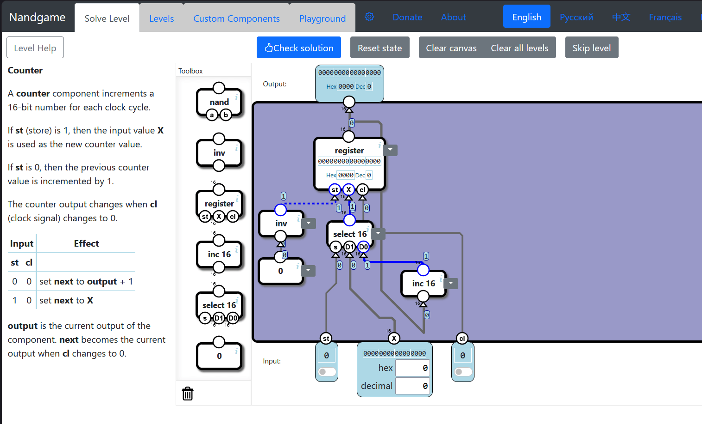

# Nandgame Solution

Optimal solution for [Nandgame](https://www.nandgame.com/).

## Usage

- Click settings on nandgame.
- Click `Import` and paste text from `nandgame-data.json`.
- Click `Import JSON` and enjoy.

## Thanks

- Introduce: https://setsideb.com/gamefinds-nandgame/
- Video tutorial: https://youtube.com/playlist?list=PL5IVyoc32QuIC-4u30bbAPWMzQSn8hkTG

## License

The MIT License.
